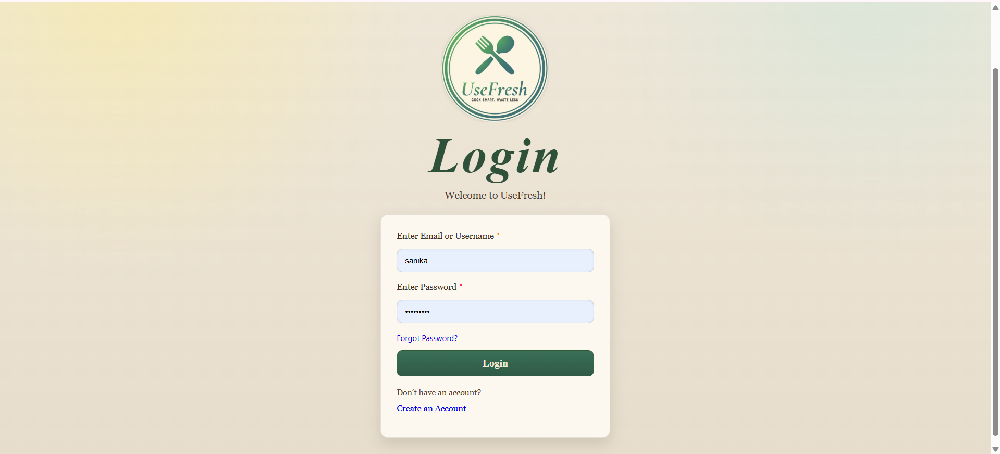
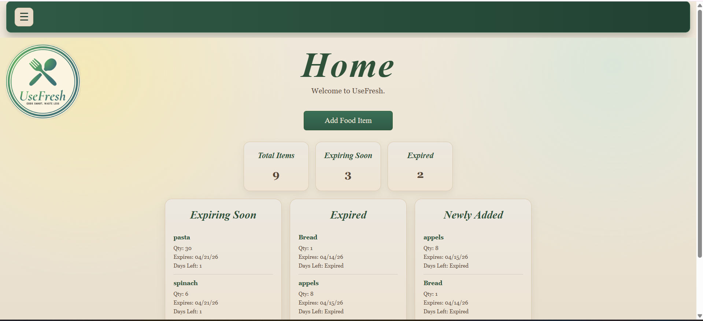
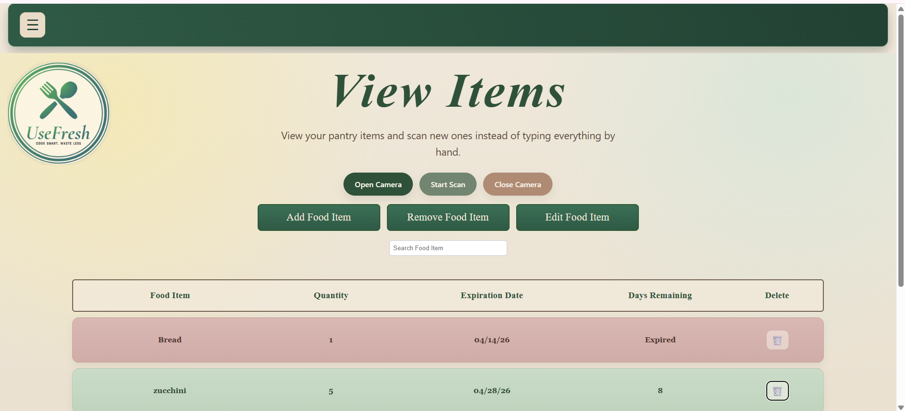
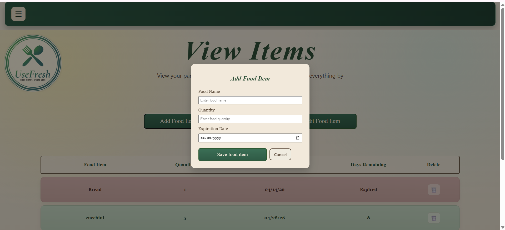
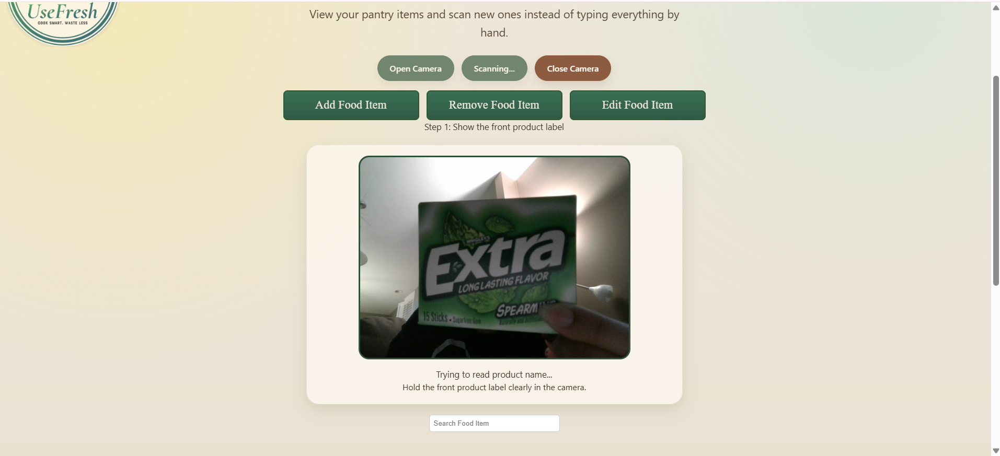
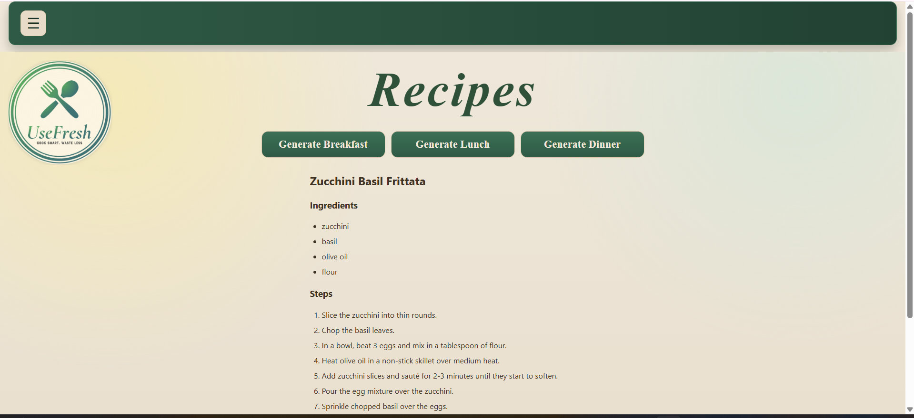
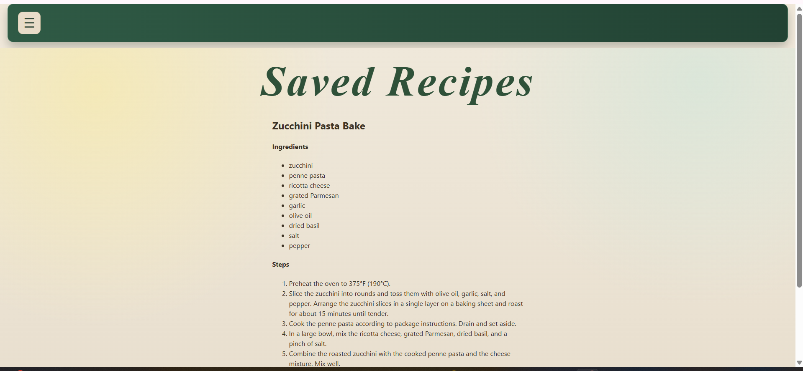

# UseFresh

UseFresh is a web application that helps users keep track of food in their pantry, reduce food waste, and utilize ingredients before they expire. The application is a combination of expiration monitoring, inventory tracking, recipe suggestions, and AI-assisted camera scanner in one place.

## Purpose

The purpose of UseFresh is to help users:

- Keep an organized record of the food items they have in their pantry
- Reduce unnecessary grocery waste
- See which items are expired or soon to be expired
- Have assistance in meal decision based on the ingredients already available
- Automate food entry with camera-based scanning tool

## Features

### User Account
- Create a new account with username, email, and password
- Log in with either username/email and password
- Store the logged in user's ID so food items can be associated with the correct logged in user

### Food Inventory Management
- Add food items with a name, quantity, and expiration date
- View saved food items
- Edit food items
- Delete food items
- Search through food items in inventory

### Expired Tracking
- Calculate how many days remain before an item expires
- Color code food items based on their expiration date
- Show recently added items on the home page
- Show soon to be expired and expired items on the home page

### AI-Assisted Features
- Generate recipe ideas from first soon to be expired items and overall food items saved in the database
- Open the device camera from the View Items page
- Scan the product labels to detect the product name
- Scan the expiration date labels to detect the expiration of the product
- Save the scanned item information into the food inventory after completing the scan

### Authentication and Security
- Passwords are hashed in the backend before being stored
- Input validation is included for user account creation, login, and food item entry

## Tech Stack

### Frontend
- React 19
- Vite (build tool)
- React Router DOM (routing)
- Axios (HTTP client)
- Bootstrap (styling)

### Backend
- Node.js
- Express.js
- MongoDB with Mongoose
- bcrypt (password hashing)
- Nodemailer (email functionality)
- dotenv
- CORS

### AI Component
- Node.js
- Express.js
- Hugging Face Inference API
- Multer (file uploads)
- MongoDB

## UI Overview

### Login Page

*Figure 1: User authentication screen with login form*

### Home Dashboard

*Figure 2: Main dashboard showing food inventory and quick actions*

### View Items 

*Figure 7: Main area showing color coded food inventory table and editing actions*

### Add Food Item

*Figure 3: Form for manually adding food items with expiration dates*

### Camera Scanner

*Figure 4: Camera interface for scanning food product labels*

### Recipe Suggestions

*Figure 5: AI-generated recipe suggestions based on expiring ingredients*

### Saved Recipes

*Figure 6: Collection of user-saved favorite recipes*


## Project Status

The project supports user account creation, login, password reset, food tracking, adding, editing, and deleting items, recipe suggestions, and camera based scanning.

## Prerequisites

- Node.js (v16 or higher)
- MongoDB database
- Hugging Face account and API token

## Installation

1. **Clone the repository**
   ```bash
   git clone <repository-url>
   cd UseFresh
   ```

2. **Install root dependencies**
   ```bash
   npm install
   ```

3. **Set up the backend**
   ```bash
   cd backend
   npm install
   ```

4. **Set up the frontend**
   ```bash
   cd ../frontend
   npm install
   ```

5. **Set up the AI component**
   ```bash
   cd ../AI_component
   npm install
   pip install -r requirements.txt  # If Python dependencies are needed
   ```

## Project Structure

UseFresh/

|--frontend/ (React)

|--backend/ (Express +MongoDB)

|--AI_component/ (HuggingFace)

|--README.md

## Environment Variables

Create `.env` files in the following directories:

### Backend (.env)
```
MONGO_URI=mongodb://localhost:27017/usefresh
PORT=3001
# Add other environment variables as needed (e.g., email service credentials)
```

### AI Component (.env)
```
MONGO_URI=mongodb://localhost:27017/usefresh
HF_TOKEN=your_hugging_face_api_token
```

## Running the Application

1. **Start MongoDB** (ensure it's running on your system)

2. **Start the AI Component** (in a separate terminal)
   ```bash
   cd AI_component
   node Scanserver.js
   ```
   The AI service will run on `http://localhost:5000`

3. **Start the Backend** (in a separate terminal)
   ```bash
   cd backend
   npm start
   ```
   The backend API will run on `http://localhost:3001`

4. **Start the Frontend** (in a separate terminal)
   ```bash
   cd frontend
   npm run dev
   ```
   The frontend will run on `http://localhost:5173` (or similar Vite default port)

## Usage

1. **Register/Login**: Create an account or log in with existing credentials
2. **Add Food Items**:
   - Manually enter food items with expiration dates and quantities
   - Use the camera scanner to scan product packaging
3. **View Inventory**: See all your food items organized by expiration date
4. **Generate Recipes**: Get AI-suggested recipes for breakfast, lunch, or dinner using your expiring ingredients
5. **Save Recipes**: Keep track of your favorite recipes for later

## API Endpoints (Backend)

### User Routes
- `POST /api/user/register` - User registration
- `POST /api/user/login` - User login
- `POST /api/user/forgot-password` - Password reset request
- `POST /api/user/reset-password` - Password reset

### Food Routes
- `GET /api/foods/all` - Get all user's food items
- `POST /api/foods/add` - Add new food item
- `PUT /api/foods/update/:id` - Update food item
- `DELETE /api/foods/delete/:id` - Delete food item

### Recipe Routes
- `POST /api/recipes/generate` - Generate recipe suggestions
- `GET /api/recipes/saved` - Get saved recipes
- `POST /api/recipes/save` - Save a recipe
- `DELETE /api/recipes/delete/:id` - Delete saved recipe

### AI Component
- `POST /suggest-recipes` - Get recipe suggestions based on expiring food

## Main Routes (FRONTEND)
- /login : the user login

- /register: the user account creation

- /home: the dashboard that shows food insights

- /items: inventory page with add, edit, delete, search, scan, and filter tools

- /forgot_password: password reset request page

- /reset_password/:token: password reset page


## Contributing

1. Fork the repository
2. Create a feature branch (`git checkout -b feature/AmazingFeature`)
3. Commit your changes (`git commit -m 'Add some AmazingFeature'`)
4. Push to the branch (`git push origin feature/AmazingFeature`)
5. Open a Pull Request

## License

This project is licensed under the ISC License.

## Acknowledgments

- Built as part of WSU-4110 course project
- Uses Hugging Face for AI-powered recipe suggestions

## Contributors

- Natalia Dycha
- Hamsini Gupta
- Gloria Llakmani
- Sanika Annadate
- Zainab Bazoun


